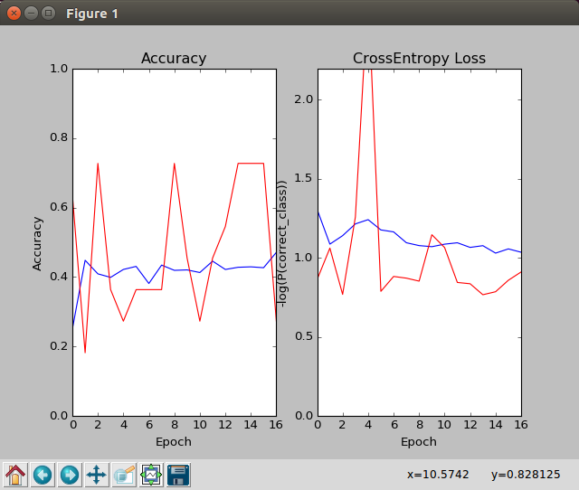
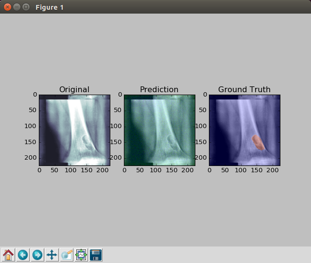

# First Aid for Medical Image Deep Learning

This is a Tensorflow implementation for a first-pass package for deep learning in medical images.  We have optimized our code for a variety of different tasks:

- n-ary classification
- n-ary segmentation

We have also used a variety of different base networks:

- [Le_Net](http://yann.lecun.com/exdb/lenet/): 5 layers (4 for segmentation)
- [Alex_Net](http://papers.nips.cc/paper/4824-imagenet-classification-with-deep-convolutional-neural-networks): 8 layers (6 for segmentation)
- [VGG_Net](https://arxiv.org/abs/1409.1556): 11, 13, 16, and 19 layer versions (9, 11, 14, and 17 for segmentation, respecitvely)
- [GoogLe_Net](https://arxiv.org/abs/1409.4842): 22 layers (22 for segmentation)
- [InceptionV3_Net](https://arxiv.org/abs/1512.00567): 48 layers (48 for segmentation)
- [Res_Net](https://arxiv.org/abs/1512.03385): 152 layers (152 for segmentation)

## Dependencies

- [Tensorflow 1.0](https://www.tensorflow.org/install/)
  - `pip install --upgrade tensorflow`
- [Cuda 8.0](https://developer.nvidia.com/cuda-downloads)
- [cuDNN](https://developer.nvidia.com/cudnn)
- Cuda compatible GPU (e.g. NVidia GTX Titan X Pascal or NVidia Tesla P100)
  - `wget nvidia-gpu`
- Python 2.7
- h5py Package
  - `pip install h5py`

## MacBook Install and Run

Here we can show how you can run this code with just a simple MacBook.  This won't use the GPU's, if you're okay with that, I'm okay with that.  Run the following code in the terminal (terminal is in the utilities folder) of your MacBook:

`pip install --upgrade tensorflow`

`pip install h5py`

Then install the FirstAid package.  You can simple download the .zip of this repository, or use the command line

`git clone https://github.com/yidarvin/FirstAid.git`

in the directory you want to have the repository.

After that, make sure your data is in the right format.  You can have some fun with a toy-directory I created called glasses.  You can see how I format the toy-directory as an example for your own data.

`git clone https://github.com/yidarvin/glasses.git`

From that directory, you can simply call (within the glasses repository)

`bash glasses.sh`

## Philosophy (of Filepath Structure)

There are four main filepaths of importance:

- training: used for training the model
- validation: used to help dictate when to save the model during training
- testing: held out test set with associated ground truth data for grading
- inference: images without ground truth to use the model on

Alright, so basically the thing that makes medical images a bit different than other images in my opinion is that things are patient oriented.  You'll eventually end up having multiple inputs or images per patient, but the final patient only really has one diagnosis.  Thus, we propose the following folder structure:

- folder_data_0 (e.g. training folder)
  - folder_patient_0
    - h5_img_0
      - data: (3d.array of type np.float32) 2d image (of any channels) of size $n \times n$
      - label: (int of type np.int64) target label
      - seg: (2d.array of type np.int64) target n-ary image for segmentation
      - name: (string) some identifier
      - height: (int) original height of the image
      - width: (int) original width of the image
      - depth: (int) original depth (number of channels) of the image
    - h5_img_1
      - etc...
    - etc...
  - folder_patient_1
    - h5_img_0
  - etc...
- folder_data_1 (e.g. validation folder)
- etc...

The fields under the h5 image are just different fields of the .h5 file.  The main image must be stored under the key "data", the segmentation map under "seg," and so on and so forth.  Also, at this point in time, the input image must be a square.  The ultimate goal is to create a single preprocessing file that converts whatever data we have into the simple format above, and then the first-aid programs should be able to do all preliminary analysis on the data.  After that, we should be able to simply create a simple postprocessing folder that can then either aggregate the results or do whatever we need to get our final data in the right format.

## Wrappers

The main python scripts to call are

- train_CNNclassification.py
- train_CNNsegmentation.py

These are the flags you can use to create the network:

#### Filepaths
- --pTrain: training filepath (don't include to skip training)
- --pVal: validation filepath (don't include to skip validation)
- --pTest: testing filepath (don't include to skip testing)
- --pInf: inference filepath (don't include to skip inference)
- --pModel: model savepath for saving and loading (don't include to skip saving)
- --pLog: log filepath (don't include to skip writing out log)
- --pVis: figure saving filepath (don't include to skip saving display figures)

#### Network Specific Definitions
- --name: name of experiment (will be used as root name for all the saving) **default: 'noname'**
- --net: name of network **default: 'GoogLe'**
  - valid: Le, Alex, VGG11, VGG13, VGG16, VGG19, GoogLe, Inception, Res
- --nClass: number of classes to predict **default: 2**
- --nGPU: number of gpu's to spread training over (testing will only use 1 gpu) **default: 1**

#### Hyperparameters
- --lr: learning rate **default: 0.001**
- --dec: learning rate decay ($<1$ decays lr) **default: 1.0 (no decay)**
- --do: keep probability for dropout **default: 0.5**
- --l2: L2 Regularization **default 0.0000001**
- --l1: L1 Regularization **default 0.0**
- --bs: Batch Size (1/nGPU of this will be sent to each gpu) **default: 12**
- --ep: Maximum number of epochs to run **default: 10**
- --time: Maximum time (in minutes) to let run **default: 1440 (24 hours)**

#### Extra Switches
- --bLo: boolean to load previous model for training **default: 0**
- --bDisp: boolean to show plots (see Section Plotting) **default: 1**

## Plotting

To help users choose when to early quit training, we'll be plotting the following things for the particular task in question:

- classification: accuracy / loss plot

- segmentation: heat maps for prediction

